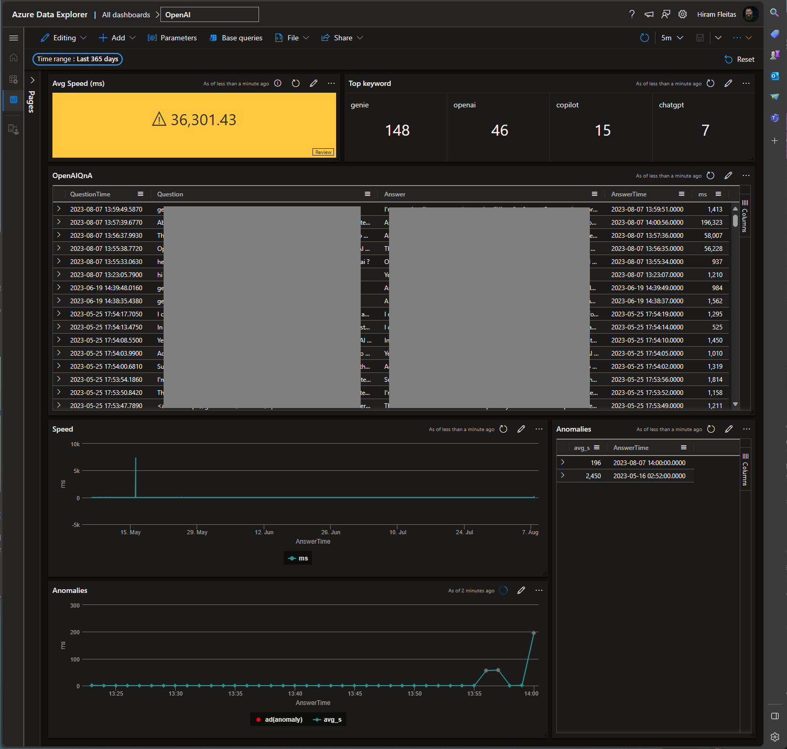

# OpenAI in MS Teams Group Chat

## Description

Invite OpenAI to your teams calls to assist w/ QnA right in chat.

### Details 🔍

This effectively gives attendees of your meeting access to ask ChatGPT Turbo 3.5, plus other LLMs, questions right in the meeting's chat using any of these keywords (genie, copilot, openai, chatgpt). Have you ever felt like you're the only SME on a call, and could use a little bit of help during a workshop? Well, this should help, plus drive more engagement.

It effectively integrates Azure OpenAI **/chat/completions** REST-API into Teams for a group chat using power automate connectors. Note, this integration will not chain the conversation due to volume & context, so it interacts 1:1.

### Instructions 🧭

Import openai*.zip package to Power Automate and configure the flow. Select your next meeting you want to invite OpenAI. 

If you wish to create a dashboard of the **QnA-only** to measure latency, tunning, etc. Then create a free ADX cluster at https://aka.ms/adx.free, import the [dashboard-OpenAI.json](dashboard-OpenAI.json) and edit datasource to your free cluster URI. Otherwise, edit the flow to not execute the ADX queries.

### Flow 🤖


Post message to chat or channel body Expression ```body('HTTP')?['choices'][0]?['message']?['content']```

Ref: https://www.youtube.com/watch?v=U00hiV1I_S0

### Dashboard-OpenAI (Preview)

## Contributing

This project welcomes contributions and suggestions.  Most contributions require you to agree to a
Contributor License Agreement (CLA) declaring that you have the right to, and actually do, grant us
the rights to use your contribution. For details, visit https://cla.opensource.microsoft.com.

When you submit a pull request, a CLA bot will automatically determine whether you need to provide
a CLA and decorate the PR appropriately (e.g., status check, comment). Simply follow the instructions
provided by the bot. You will only need to do this once across all repos using our CLA.

This project has adopted the [Microsoft Open Source Code of Conduct](https://opensource.microsoft.com/codeofconduct/).
For more information see the [Code of Conduct FAQ](https://opensource.microsoft.com/codeofconduct/faq/) or
contact [opencode@microsoft.com](mailto:opencode@microsoft.com) with any additional questions or comments.

## Trademarks

This project may contain trademarks or logos for projects, products, or services. Authorized use of Microsoft 
trademarks or logos is subject to and must follow 
[Microsoft's Trademark & Brand Guidelines](https://www.microsoft.com/en-us/legal/intellectualproperty/trademarks/usage/general).
Use of Microsoft trademarks or logos in modified versions of this project must not cause confusion or imply Microsoft sponsorship.
Any use of third-party trademarks or logos are subject to those third-party's policies.
